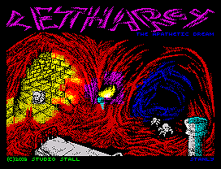
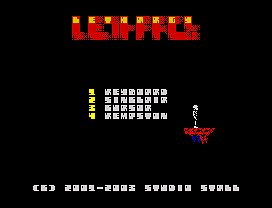
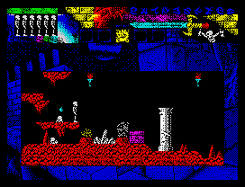
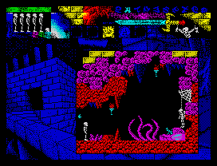
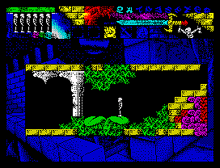

# Lethargy: The Apathetic Dream

ZX Spectrum game sources

## Credits
**Code**: Павел Стахов (Pavel Stakhov) aka capry/tsapree, email: [tsapree@gmail.com], github: [https://github.com/tsapree/]   
**Idea, Graphics, Map**: Станислав Аристов (Stanislav Aristov) aka stanly/poltergejst  
**Music**: Денис Покалюк (Denis Pokalyuk) aka Fatal Snipe

  
   

## History
**Lethargy: The Apathetic Dream** была представлена 23-24 августа 2003
на CaFe2003 в Санкт-Петербурге. 
Игра разрабатывалась в 2001-2003 годах на архитектуре ZX Spectrum
(использовался эмулятор Unreal, настроенный эмулировать клон Quorum 1024Mb).
Исходники написаны на ассемблере Alasm v4.44.
Кодировка текста в образах дискет: IBM866/CP866/DOS

Исходники добыты из TRD-образов дискет и переведены в текстовые файлы.

Читать код игры следует с главного файла HELL. 
Спрайты игры нарисованы в Spriter и выгружены частично в виде
исходного кода Alasm, частично в виде бинарных файлов.

ps. В коде есть ругательства, простите. 22 года назад
казалось остроумным.

pps. Спустя время депрессивный (а иногда даже желчный) тон игры и текстов вызывает
некоторое недоумение, но что есть, то есть.

ppps. Прохождение игры можно посмотреть на Youtube: [Lethargy: The Apathetic Dream 128k (2003) Walkthrough](https://www.youtube.com/watch?v=4eyE1xFZBBE)